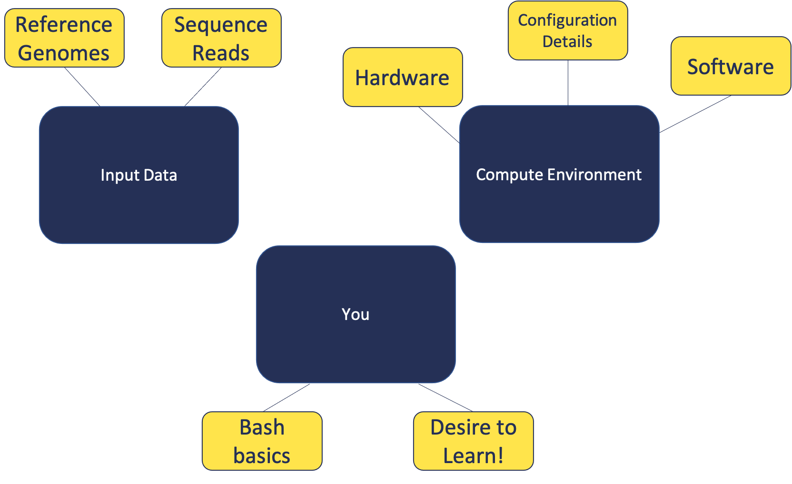

<style type="text/css">
body{ /* Normal  */
      font-size: 14pt;
  }
pre {
  font-size: 12pt
}
</style>

In this module, we will:

* cover basic materials needed
* familiarize ourselves with remote computing
* prepare for later modules

## Building Blocks

<br>
<br>
<br>

<br>
<br>
<br>


## Example Files Exercise:

1. Download the zipped archive from the slack channel
2. Locate, move (if desired), and unzip it
3. Remember how to access these files

<br>
<br>
<br>
<br>
<br>
<br>

## Local vs Remote Exercise:

1. Become familiar with the appearance of the local shell
2. Briefly explore your local files (optional)
3. Log in to the aws instance with `ssh <username>@bfx-workshop01.med.umich.edu`
4. Become familiar with appearance of the remote shell
5. Use `ls` to view references
6. Use `ls` to view input fastq files
7. Use `mkdir` to create a folder for our analysis

<br>
<br>
<br>

```
# Familiarize with local shell appearance
# Briefly explore your local files
ls -l
# Log in to the aws instance via ssh
ssh <username>@bfx-workshop01.med.umich.edu
# Familiarize yourself with differences between local and remote shell
# View our references
ls ~/RSD_Shell/refs
# View our input fastq files
ls ~/RSD_Shell/reads
# Create a folder for our analysis
mkdir ~/RSD_Shell/analysis
```


<br>
<br>
<br>

<details>
<summary>Click here for demonstration comparing local Windows command prompt vs remote (AWS)</summary>


</details>

<br>
<br>
<br>

<details>
<summary>Click here for more info about retrieving sequences from SRA</summary>

The Sequence Read Archive (SRA) is an immense source of publicly-available high-throughput sequencing data, hosted by the NIH's National Center for Biotechnology Information (NCBI). It also contains data from the European Bioinformatics Institute (EMBL-EBI), and the DNA Data Bank of Japan (DDBJ).

These data can be useful for validating experimental results, and they can also allow for the savvy researcher to leverage this data to shed light on their own research questions.

In these exercises, we're using data from SRA to provide a good example of an RNASeq dataset, and also to demonstrate the process of validating experimental results of a published article, starting from the raw sequencing data.

Below we provide some instruction and suggested starting points for each of the steps you'd take to retrieve sequence data from SRA for yourself. Generally, the steps are:

- Install and configure the SRA Toolkit software
- Find your dataset(s) of interest
- Download your sequences using SRA Toolkit


### Installing/Configuring SRA Toolkit

We recommend using High Performance Compute (HPC) resources if you want to perform an analysis on your own. At the University of Michigan, Advanced Research Computing (ARC) provides these resources, one you may hear of often is known as "The Great Lakes Cluster". There, they provide a software module `sratoolkit` that you can use. This way, the software is already installed for you! Then it is very easy to load this module to give access to the software.

    #You must load the Bioinformatics module, then sratoolkit
    module load Bioinformatics
    module load sratoolkit

After the software is available, another important step is to configure it. There is a [helpful page here about configuration](https://github.com/ncbi/sra-tools/wiki/03.-Quick-Toolkit-Configuration). The most important detail will probably be to ensure that you set the cache location to somewhere with plentiful storage space.

> Note: On Great Lakes, the cache will likely be automatically be set to your home directory. This can be a problem, since user home directories have less than 100GB available. Setting this to the [scratch space](https://arc.umich.edu/scratch-storage/) might be a good option.

### Finding dataset(s) of interest:

NCBI has some [useful help pages here](https://www.ncbi.nlm.nih.gov/sra/docs/srasearch/#basic-search-in-sra)

If you already have e.g. your relevant project accession ID, and want to get associated run accession IDs, you may also find it useful to use the [SRA Run Selector tool](https://www.ncbi.nlm.nih.gov/Traces/study/).

When you have your list of run accessions, e.g. `SRR7777895`, then you will be ready to download your sequences using the SRA Toolkit

### Downloading your sequences using SRA Toolkit

Once again there are helpful documentation pages for this part of the SRA Toolkit, which you can find [here](https://github.com/ncbi/sra-tools/wiki/08.-prefetch-and-fasterq-dump). The SRA Toolkit documentation recommends using two steps to download fastq files: `prefetch` which downloads relevant data, followed by `fasterq-dump` which creates the fastq formatted files from the prefetched data.

Note: `fasterq-dump` is an updated and streamlined version of an older software, `fastq-dump`. You may encounter older blog posts which reference `fastq-dump`, or you may hear from colleagues about using it. Either is fine to use, and both of them are part of SRA Toolkit, but it seems `fasterq-dump` is recommended going forward.

Note: It is also possible to directly use `fastq-dump` without first using `prefetch`. However, it will be slow and prone to failure with any network issues.

</details>

<br>
<br>
<br>
<br>
Sneak Preview
<br>
<br>
<br>

<br>
<br>
<br>
<br>
<br>
<br>
<br>
<br>
<br>
<br>


<br>
<br>
<br>
<br>

<br/>
<br/>
<hr/>
| [Back to Introduction](Module00_Introduction.html) | [Top of this lesson](#top) | [Next lesson](Module02a_Sequence_QC.html) |
| :--- | :----: | ---: |
