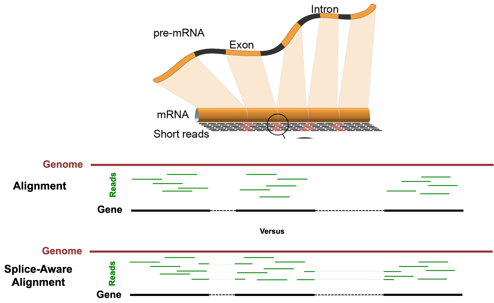

<style type="text/css">
body{ /* Normal  */
      font-size: 14pt;
  }
pre {
  font-size: 12pt
}
</style>

In this module, we will learn:

* the concept of splice-aware alignments
* the two steps needed to run RSEM+STAR
* details of SAM and BAM files, and RSEM outputs

# Differential Expression Workflow

We'll discuss the alignment and gene quantification steps which gather the necessary data that we will need prior to testing for differential expression, the topic of Day 2.


<br>
<br>
<br>
<br>

# Alignment and Gene Quantification

The FASTQ files of raw sequenced reads are untethered from any notion of where they came from in the genome, and which transcribed genes the sequence belongs to. The alignment and gene quantification steps fill in that gap and allow us to proceed with the question we are really interested in: Which genes are differentially expressed between groups of samples?

We will use RSEM ([paper](https://bmcbioinformatics.biomedcentral.com/articles/10.1186/1471-2105-12-323) and [GitHub](https://github.com/deweylab/RSEM)) combined with STAR Aligner ([paper](https://academic.oup.com/bioinformatics/article/29/1/15/272537) and [GitHub](https://github.com/alexdobin/STAR)) to accomplish the task of read mapping and gene quantifcation simultaneously.

## STAR

The "Spliced Transcripts Alignment to a Reference" (STAR) Aligner is aware of splice-sites of transcripts and is able to align reads that span them. The figure below illustrates the difference between splice-unaware aligners (e.g. Bowtie2) and splice-aware aligners (e.g. STAR).

Some benefits of splice-aware aligners include:

* Fewer reads are discarded for lack of alignments, leading to more accurate gene quantification.
* Direct evidence of isoform usage is possible.

We should note that the default parameters for STAR are optimized for **mammalian genomes**.

<center>



Credit: https://raw.githubusercontent.com/hbctraining/Intro-to-rnaseq-hpc-O2/master/lectures/Sequence_alignment.pdf

</center>

## RSEM

RSEM (RNA-seq by Expectation Maximization) determines gene and isoform abundance using an expectation maximization (EM) algorithm to determine the probability that any particular read originated from a particular transcript. From there, gene-level quantification is reported by effectively collapsing the isoform quantifications over all isoforms belonging to the gene.

The primary issue that RSEM attempts to solve is that reads can align to multiple isoforms (when, for example, they share an exon), and that creates ambiguity in deciding which isoform a read gets assigned to for quantification. RSEM uses the EM algorithm described above to handle this ambiguity appropriately.

# Running RSEM+STAR

RSEM can be run with just two commands: the first `rsem-prepare-reference` ([manual](https://deweylab.github.io/RSEM/rsem-prepare-reference.html)) builds an index for STAR and RSEM to use, and the second `rsem-calculate-expression` ([manual](https://deweylab.github.io/RSEM/rsem-calculate-expression.html)) does the alignment and gene quantification.

We'll explore the expected outputs from these commands and discuss their contents, before creating our own reference and aligning reads with our example data.

## `rsem-prepare-reference` Details

 The purpose of `rsem-prepare-reference` is to create a reference index for alignment. A reference index is essentially a lookup table that speeds up the finding of sequence matches for alignment. In the case of a splice-aware aligner, the reference index is also aware of the various splice junctions at locations in the gene model, and a subset of reads will map across these. This allows us to infer isoform usage later on.

`rsem-prepare-reference` will use a FASTA file and a GTF as inputs, and it will produce a number of large files which make up the index. RSEM has the flexible capability of supporting multiple different aligners. We'll be using STAR. The output files therefore contain items from the indexing process of STAR and RSEM. These files allow for the fast and efficient search and retrieval of sequence and gene-model information during alignment and quantification. The outputs will look like the following:

    GRCm38.102.chr19reduced.chrlist
    GRCm38.102.chr19reduced.grp
    GRCm38.102.chr19reduced.idx.fa
    GRCm38.102.chr19reduced.n2g.idx.fa
    GRCm38.102.chr19reduced.seq
    GRCm38.102.chr19reduced.ti
    GRCm38.102.chr19reduced.transcripts.fa
    Genome
    Log.out
    SA
    SAindex
    chrLength.txt
    chrName.txt
    chrNameLength.txt
    chrStart.txt
    exonGeTrInfo.tab
    exonInfo.tab
    geneInfo.tab
    genomeParameters.txt
    sjdbInfo.txt
    sjdbList.fromGTF.out.tab
    sjdbList.out.tab
    transcriptInfo.tab

## `rsem-calculate-expression` Details

After preparing the reference index, we can do alignment and quantification with the `rsem-calculate-expression` command ([here](https://deweylab.github.io/RSEM/rsem-calculate-expression.html) is a link to the manual). For our inputs, we will be using our FASTQ reads and the path to the reference index that we create.

There are numerous outputs, which are laid out in the following table:

| File | Description |
| ---- | ----------- |
| `sample_N.genome.bam` | The alignments in genomic coordinates. Used for visualization in a genome browser such as [IGV](https://software.broadinstitute.org/software/igv/). |
| `sample_N.transcript.bam` | The alignments in transcriptomic coordinates. Not used for this workshop. |
| `sample_N.genes.results` | Gene-level results to be used in downstream DE analysis. |
| `sample_N.isoforms.results` | Isoform-level results. Not used for this workshop. |


The two results we will use most often from RSEM+STAR are the gene-level quantifications (`sample_N.genes.results`) and the alignments in genome-coordinates (`sample_N.genome.bam`). Each sample for which we run RSEM+STAR will have these output files named after the sample.

### Genome Alignments

The `sample_N.genome.bam` alignments file is a special, compressed, version of a SAM file (sequence alignment/map). In order to view it, we have to use a special program called [`samtools`](https://www.htslib.org/doc/samtools.html).

If we were to peek inside of `sample_N.genome.bam`, we would see many columns of data. By using `samtools`, we will be able to view the columns in plain text (SAM format). The mandatory columns in SAM format are shown in the following table from the [official SAM/BAM format specification](https://samtools.github.io/hts-specs/SAMv1.pdf).


The SAM format gives information about where each read maps to in the genome (one read per line), and has information about that mapping.

<br><br>

<br><br>

### Gene-level Quantification

If we were to look at the top 3 lines of `sample_N.genes.results`, we see it is a plain-text file separated by tabs where each row is a gene, and the columns are described the first row.


| Column | Description |
| ---- | ----------- |
| gene_id | The ID from the gene model GTF. |
| transcript_id(s) | The transcript IDs corresponding to the gene in the gene model GTF. |
| length | The weighted average of its transcripts' lengths. |
| effective_length | The weighted average, over its transcripts, of the mean number of positions from which a fragment may start within the sequence of transcript. |
| expected_count | The sum, over all transcripts, of the estimated counts from the EM algorithm. |
| TPM | Transcript per million, a relative measure of transcript abundance where the sum of all TPMs is 1 million. |
| FPKM | Fragments per kilobase of transcript per million mapped reads. |


The `genes.results` files for each sample can be directly imported into DESeq2 using the [`tximport`](https://bioconductor.org/packages/release/bioc/vignettes/tximport/inst/doc/tximport.html#rsem) R Bioconductor package.

Alternatively, we can combine these results into a count matrix. The count matrix can be very useful, since it contains summary-level data in a widely supported format, this makes it great for sharing and as input into different analyses.


## RSEM Prepare Reference Exercise:

1. View the help page for rsem-prepare-reference
2. Create a command that will index our example genome, but do not run it

```
# View the help file
rsem-prepare-reference -h
# Create/execute the prepare-reference command
rsem-prepare-reference --gtf ../refs/GRCm38.102.chr19reduced.gtf --star --num-threads 1 ../refs/GRCm38.102.chr19reduced.fa ../refs/GRCm38.102.chr19reduced
```


## RSEM Calculate Expression Exercise:

1. View the help page for rsem-calculate-expression
2. Create a command to execute RSEM / STAR alignment and quantification for one of our samples

```
# First create a directory for the aligned results
mkdir out_rsem
# Construct an RSEM command to align sample_A to our reference
rsem-calculate-expression --star --num-threads 1 --star-gzipped-read-file --star-output-genome-bam --keep-intermediate-files out_trimmed/sample_A_R1.trimmed.fastq.gz ../refs/GRCm38.102.chr19reduced out_rsem/sample_A
```
<br>
<br>

## Aligning All Samples Exercise:

Before starting our alignment exercise, we should make sure that we are on the same page. Follow the link below:

[Link to alignment exercise](Module03b_breakout02_ex.html)

<br>
<br>

---

These materials have been adapted and extended from materials created by the [Harvard Chan Bioinformatics Core (HBC)](http://bioinformatics.sph.harvard.edu/). These are open access materials distributed under the terms of the [Creative Commons Attribution license (CC BY 4.0)](http://creativecommons.org/licenses/by/4.0/), which permits unrestricted use, distribution, and reproduction in any medium, provided the original author and source are credited.

<br/>
<br/>
<hr/>
| [Previous lesson](Module03a_Reference_Genomes.html) | [Top of this lesson](#top) | [Next lesson](Module04_Alignment_QC_and_Quantification.html) |
| :--- | :----: | ---: |
