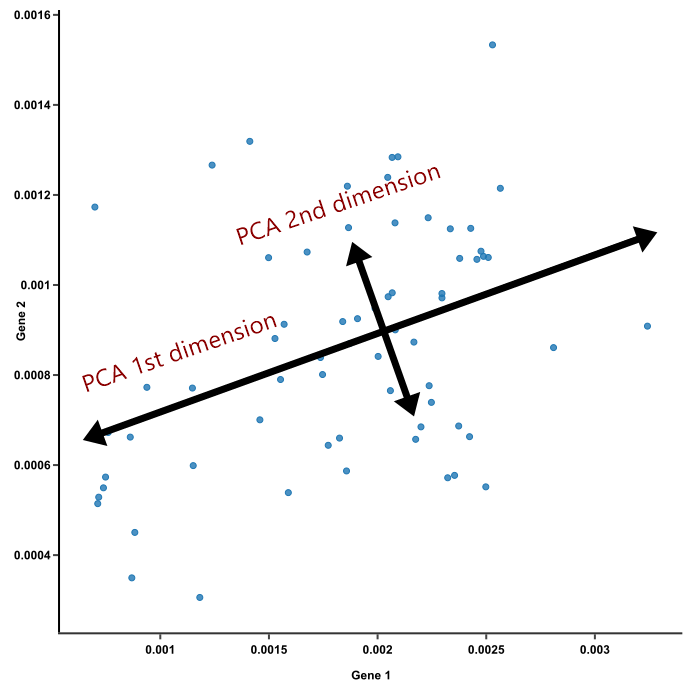

<style type="text/css">
body, td {
   font-size: 18px;
}
code.r{
  font-size: 12px;
}
pre {
  font-size: 12px
}
</style>

```{r, include = FALSE}
source("../bin/chunk-options.R")
knitr_fig_path("09-")
```

In this module, we will learn:

* How to generate & interpret common QC visualizations
* Implications of batch effect or other technical variablity
* When to revise the model used in the DESeq2 initialization


<br>

```{r Modules, eval=TRUE, echo=FALSE, message=FALSE, warning=FALSE}
library(DESeq2)
library(ggplot2)
library(tidyr)
library(dplyr)
library(matrixStats)
library(ggrepel)
library(pheatmap)
library(RColorBrewer)
# load("rdata/RunningData.RData")
```

# Differential Expression Workflow {.unlisted .unnumbered}

Prior to testing for differential expression between our comparisons of interest, we'll first generate plots that will assess how well our samples match up with our expectations (based on their treatment groups) and what we might expect to see from our differential expression comparisons.

{width=75%}

---

# Quality Control Visualizations

We have already examined quality control assessment at the sequencing level with `FastQC` and `MultiQC`. Now, we will examine sample-level and gene-level quality control for our expression data.

To do this, we will first assess the similarity of our samples by using principal component analysis (PCA). This will allow us to determine how well patterns in the data fit our expectations from the experiments design and examine possible sources of variation.

Other common visualizations that we generate for our analyses include expression heatmaps, sample correlation heatmaps, and boxplots of raw and/or normalized counts, the code for which (due to time restrictions) can be found as bonus content throughout the materials for today or in the bonus content module.

# Principal Component Analysis

A common and very useful plot for evaluating how well our samples cluster by treatment groups are Principal Component Analysis (PCA) plots. PCA is used to bring out patterns in large and complex datasets using dimensionality reduction.

As described in more detail in [this blogpost from BioTuring with a helpful step by step explaination ](https://blog.bioturing.com/2018/06/14/principal-component-analysis-explained-simply/), PCA has three key attributes:

* Reduces the high dimensionality of a dataset into a few components.  
* Each principle component captures the maximum remaining variation in a dataset (as illustrated for PC1 and PC2 in the figure below).  
* Each principle component is defined by different weights of the original dimensions (e.g. gene expression).  




A more detailed overview of the PCA procedure is outlined in [a Harvard Chan Bioinformatic Core training module](https://hbctraining.github.io/DGE_workshop/lessons/principal_component_analysis.html), which is based on a more thorough description presented in a [StatQuest’s video](https://www.youtube.com/watch?v=_UVHneBUBW0). Additionally, this [TowardsDataScience blog post](https://towardsdatascience.com/principal-component-analysis-3c39fbf5cb9d) goes through the math behind PCAs.


## Interpreting PCA plots

For most bulk RNA-seq experiments, we expect the majority of the total variance to be explained by the first two or three principal components. We see this in an example plot from the [DESeq2 vignette](http://bioconductor.org/packages/devel/bioc/vignettes/DESeq2/inst/doc/DESeq2.html):


> # Question {.unlisted .unnumbered}
>
> How might we interpret the variance explained by each principal component in the context of the labeled sample points?


## Evaluating batch effects or possible confounders

PCA plots are also useful for evaluating the impact of "uninteresting" sources of variance, like library preparation or sequencer differences. Evidence of batch effects can sometimes be quite obvious. Let's look at the PCA plot from the DESeq2 vigentte again but re-colored to highlight structure in the data.


It turns out this experiment contained samples sequenced single-end and paired-end. If we add an attribute to the plot for the sequencing type (paired-end vs. single-end), we see that in this example PC2 (29% of variance) is primarily explained by this technical covariate.


However, since the samples are clearly separated by experimental condition on PC1 **and** there are balanced batches, if we saw this pattern in our data we could incorporate the technical covariate into our model design, such as outlined in the [DESeq2 vignette](http://bioconductor.org/packages/devel/bioc/vignettes/DESeq2/inst/doc/DESeq2.html#multi-factor-designs).

<details>
    <summary>*Click for complex design discussion*</summary>
    In experiments with more complex designs, such as when there are interesecting/multiple treatment conditions, it can be less clear what covariants are influencing expression, such as illustrated from [this documenation for a microarray analysis tool](http://www.molmine.com/magma/global_analysis/batch_effect.html).
    From the PCA labeled by experimental treatment, we see that samples from the treatment group do not cluster together and that there is high variance across all treatment groups.
    
    However, when the plot is color coded by the technical batches of probe labeling, we see that the patterns in the data are better explained by batch than the experimental conditions.
    
</details>
<br>

# Create a PCA

We've already loaded the libraries we need for this module. We have also thought ahead in the previous module and created the `outputs/figures` and `outputs/tables` directories.

Below, we will plot the rlog normalized data and generate the PCA projections for the top 500 using the `plotPCA` function from DESeq2, first specifying `condition` as the condition of interest, and view the simple plot generated by the function.

```{r PCArlog3}
# create PCA plot, labeled by condition
pca_plot = plotPCA(rld, intgroup = c('condition'), ntop = 500)
pca_plot
```

The samples don't appear to cluster too tightly on their `condition`, but we do observe that they separate in PC2. With real data, it is often the case that data doesn't cluster as well as you'd expect, or that the covariate of interest is not associated with the first (or second or third) principal component. That doesn't necessarily mean the experiment is a failure, but it does raise questions such as "What is associated with PC1?".

Next, let's plot the same data but now labeling by the batch column from our metadata and adding a title with `ggtitle`:
```{r BatchPCA}
# create PCA plot with batches labeled
pca_plot_batch = plotPCA(rld_batch, intgroup = c('batch'), ntop = 500) + ggtitle(title="Batch labeled - iron deficiency data")
pca_plot_batch
```

Next, let's save these plot as files in our `outputs/figures` folder. Since both plots are `ggplot` objects -- you can see this with `class(pca_plot)`-- we can use `ggsave()`.

```{r save_pca_ggsave, eval = FALSE}
# save PCA plots to file
ggsave(
    filename = file.path('outputs', 'figures', 'PCA_rlog_condition.pdf'),
    plot = pca_plot_batch,
    width = 6, height = 6, units = 'in')

ggsave(
    filename = file.path('outputs', 'figures', 'PCA_rlog_batch.pdf'),
    plot = pca_plot_batch,
    width = 6, height = 6, units = 'in')
```


**Checkpoint**: *If you generated and saved the `pca_plot` PCA plot, please indicate with the green 'check' button. Otherwise, please use the red 'x' button in your zoom reaction panel and post any commands AND error messages to slack.*


While the `pca_plot` object is a `ggplot`- we can also assign the underlying data generated by the `plotPCA` function to an object to make plot customization easier as well as calculate the percent variance of each component 

```{r PCATable}
# create table of underlying PCA data that can be used for more customized plots
pcaData <- plotPCA(rld, intgroup=c("condition"), returnData=TRUE)
percentVar <- round(100 * attr(pcaData, "percentVar")) # store PC axes (% variance)

head(pcaData) # see the data
str(pcaData) # check the structure
```


With this table of PCA statistics, we can use what we learned at the end of the Computational Foundations Workshop to customize plot as we might see necessary. 

**What are some modifications we might want to make?** [use slack poll to rank]:

**Examples:**

- Change the overall theme of the plot
- Add an informative plot title to make interpretation/sharing easier
- Add labels to show which samples correspond to which points
- Make our color palette color-blind friendly
- Use shape instead of color of the points to indicate groups on the PCA plot

<br>

## Customizing a PCA

Before working independently on an exercise, we'll work together to build a command to plot our `pcaData` with more familiar `ggplot2` syntax. 

In this example, we'll still use color to indicate our groups but we'll customize the plot to have the same black and white theme that we used in Computational Foundations and add an informative title. Recall that `ggplot2` adds plot components in layers, and we can add additional layers with the `+` sign.

```{r PCACustomDemo}
# create custom plot object
PCACustom <- ggplot(pcaData, aes(PC1, PC2, color=condition)) +
  geom_point(size=3) +
  coord_fixed() +
  theme_bw() + 
  labs(title = "PC1 and PC2 for iron deficient mouse samples")

# add percentVar labels to *displayed plot*
PCACustom + 
  xlab(paste0("PC1: ",percentVar[1],"% variance")) +
  ylab(paste0("PC2: ",percentVar[2],"% variance"))

# add percentVar labels to *stored plot object*
PCACustom2 <- PCACustom + 
  xlab(paste0("PC1: ",percentVar[1],"% variance")) +
  ylab(paste0("PC2: ",percentVar[2],"% variance"))

```

Now we have our PCA plotted with ggplot functions that might look more familiar.


> ## Independent Exercise - Customize a PCA 
> (10-15 minutes)
> 
> Like earlier - we'll plan to work independently in the main room. This is a time to read function documentation, test out ideas, make mistakes, and use a search engine to look up errors or possible example solutions. Please post any questions or errors that arise to slack. We'll review possible solutions together at the end.
> 
> 
> Try doing the following to the `pca_plot`, starting with the "most popular" request and moving on to other customizations if you have time:
>
> * Add a title and subtitle to the plot
> * Update the color palette to be color-blind friendly
> * Add labels to show which samples correspond to which points
> * Use shape instead of color to indicate groups on the PCA plot.
> * _Challenge_: Change the legend title to "Iron Status". 
>
> [Link to exercise](Module09a_breakout.html)


<details>
<summary>Possible solutions to exercise prompts</summary>

Here are examples of some possible approaches:

* Add a title and subtitle to the ggplot plot
```{r, eval= FALSE}
# add title and subtitle
PCACustom2 + 
  labs(title = "Iron Supplemented Mice", subtitle = "PCA of top 500 genes")
```


* Add labels to show which samples correspond to which points

```{r, eval= FALSE}
# display with labels
PCACustom2 + 
  geom_text_repel(aes(label = name), 
                  point.padding = 0.5, 
                  box.padding = 0.5)
```


* Make our color palette more color-blind friendly

```{r, eval= FALSE}
# look at pre-made color palettes from RColorBrewer
display.brewer.all(colorblindFriendly = TRUE)
# use RColorBrewer palette
PCACustom2 + 
  scale_colour_brewer(palette = "Set2")

# OR customize using manual color palette
# The R Cookbook palette with grey:
cbPalette <- c("#999999", "#E69F00", "#56B4E9", "#009E73", "#F0E442", "#0072B2", "#D55E00", "#CC79A7")

# To use for line and point colors, add manual color scaling with custom palette
PCACustom2 + 
  scale_colour_manual(values=cbPalette[2:3])
```


* Use shape instead of color to indicate groups on the PCA plot. 

```{r, eval= FALSE}
# generate new aesthetic mapping (with default shapes selected)
ggplot(pcaData, aes(PC1, PC2, shape=condition)) +
  geom_point(size=3) +
  coord_fixed() +
  theme_bw() + 
  xlab(paste0("PC1: ",percentVar[1],"% variance")) +
  ylab(paste0("PC2: ",percentVar[2],"% variance"))

# generate new aesthetic mapping (with manually selected shapes)
ggplot(pcaData, aes(PC1, PC2, shape=condition)) +
  geom_point(size=3) +
  scale_shape_manual(values = c(1, 4)) +
  coord_fixed() +
  theme_bw() + 
  xlab(paste0("PC1: ",percentVar[1],"% variance")) +
  ylab(paste0("PC2: ",percentVar[2],"% variance"))
```


* _Challenge_: Change the legend title to "Iron Status"

```{r, eval= FALSE}
#  customize label for colour mapping
PCACustom2 + 
  guides(colour=guide_legend(title="Iron supplementation status")) 

# alternatively specify label for aesthetic mapping
PCACustom2 + 
  labs(colour="Iron supplementation status")
```

</details>
<br>


----


# Download plots

Rstudio server allows us to download files through the interactive file panel on the right side. If we navigate into the plot subfolder and select the `PCAplot_rlog_condition.pdf` or the  file, we can then click the blue gear symbol labeled `More` and select `Export...`. We should see a prompt regarding the name of the file and if we click `Download` the file should show up in your local "Downloads" folder.

# Optional content

<details>
    <summary>*Click for example code for generating a ScreePlot visualization of variance across all principle components*</summary>
     A screeplot is a way to visualize the variance explained by all principal components.
     To generate a scree plot, the PCA results need to be used independently of plotting, such as described by [this statquest post](https://statquest.org/pca-clearly-explained/) and replicated below.

```{r ScreePlot}
# generate PCA loadings
pcaLoadings = prcomp(t(assay(rld)), scale. = TRUE)

## get the scree information
pca.var = pcaLoadings$sdev^2
scree = pca.var/sum(pca.var)
barplot((scree[1:10]*100), main="Scree Plot", xlab="Principal Component", ylab="Percent Variation")
```

    We can see that the majority (~65%) of the variance across our samples is explained by the first three principal components, giving us some additional confidence regarding the quality of our data.
    In these scree plot examples from BioTuring, the plot on the left fits what we would expect for a dataset with high signal from the experimental treatment, where the majority of the variance is explained by the first few principal components. The plot on the right illustrates a scenario where the variance is distributed across many components, which could be due to low signal from the experimental treatment, complex experimental design, or confounding factors.
image: 
</details>
<br>

# Summary

In this section, we:

* Discussed variance within treatment groups
* Discussed technical artifacts, including batches
* Learned to generate PCA plots

---

# Sources

* HBC QC tutorial: https://hbctraining.github.io/DGE_workshop/lessons/03_DGE_QC_analysis.html
* Detailed Heatmap tutorial from Galaxy: https://training.galaxyproject.org/training-material/topics/transcriptomics/tutorials/rna-seq-viz-with-heatmap2/tutorial.html
* PCA Overview: https://blog.bioturing.com/2018/06/14/principal-component-analysis-explained-simply/

```{r WriteOut.RData, eval=FALSE, echo=FALSE, message=FALSE, warning=FALSE}
#Hidden code block to write out data for knitting
# save.image(file = "rdata/RunningData.RData")
```

---


These materials have been adapted and extended from materials listed above. These are open access materials distributed under the terms of the [Creative Commons Attribution license (CC BY 4.0)](http://creativecommons.org/licenses/by/4.0/), which permits unrestricted use, distribution, and reproduction in any medium, provided the original author and source are credited.

<br/>
<br/>
<hr/>
| [Previous lesson](Module08_DESeq2DE.html) | [Top of this lesson](#top) | [Next lesson](Module10_DEComparisons.html) |
| :--- | :----: | ---: |