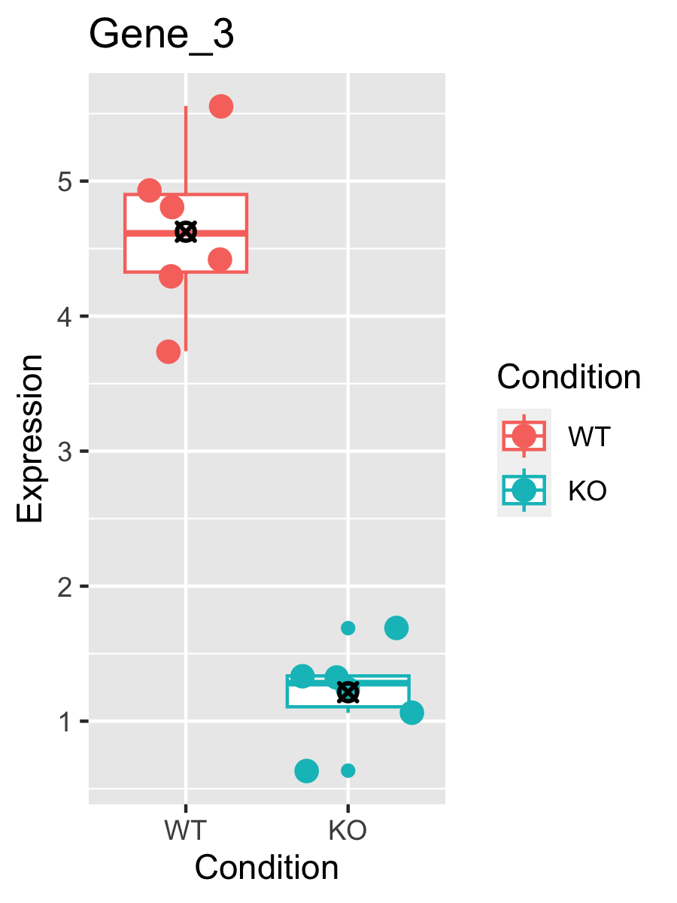
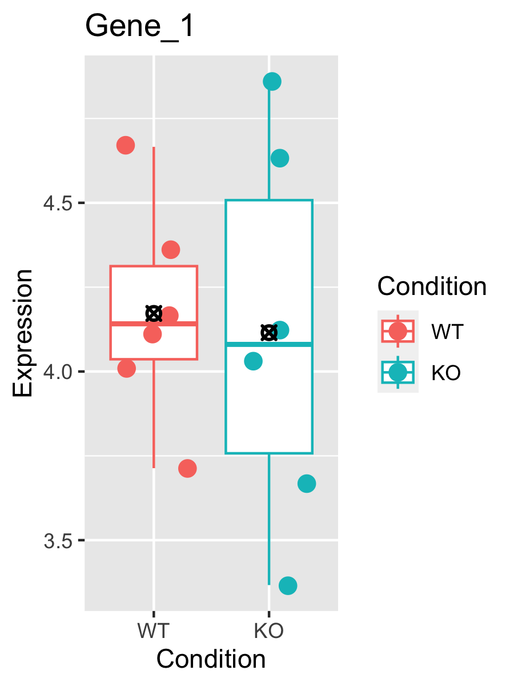
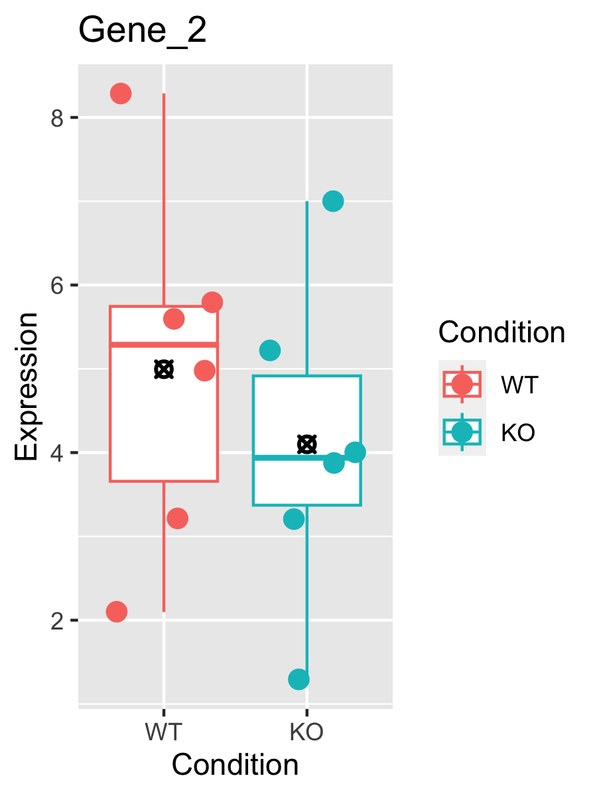
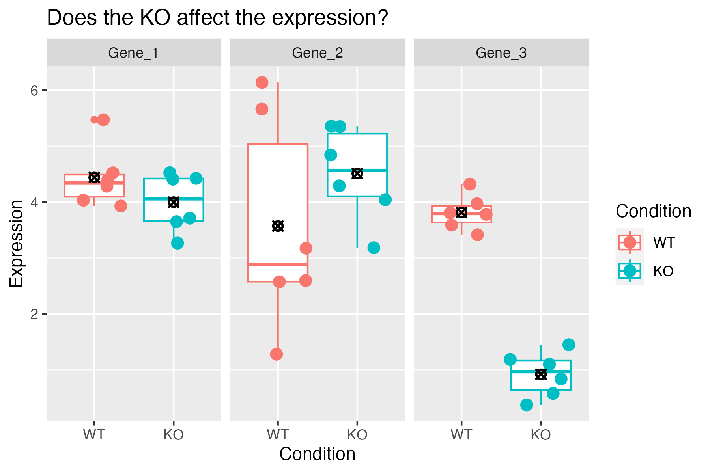

<style type="text/css">
body, td {
   font-size: 18px;
}
code.r{
  font-size: 12px;
}
pre {
  font-size: 12px
}
</style>

```{r, include = FALSE}
source("../bin/chunk-options.R")
knitr_fig_path("10-")
```

> # Objectives {.unlisted .unnumbered}
> * Generate tables of DE results
> * Understand what a p-value represents.
> * Understand multiple hypothesis correction application and importance


```{r Modules, eval=TRUE, echo=FALSE, message=FALSE, warning=FALSE}
library(DESeq2)
library(tidyr)
library(dplyr)
# load("rdata/RunningData.RData")
```

# Differential Expression Workflow {.unlisted .unnumbered}

Now we test for differential expression between our groups of interest and return a table of results.

{width=75%}

---

# Testing for DE

Before showing the code for generating differential expression results, let's walk through some toy data and discuss our intuition, its limitations, and what we can do to formalize our thought around determining if a gene is differentially expressed.

Let's start by looking at expression boxplots for a few "genes" where we've made up the data. In each plot, we are comparing the expression levels (on the y-axis) for samples (each point) representing a WT (red) and KO (teal) condition. The boxplot shows the 25% - 75% distribution, along with outliers, with a bar representing the median value, and a black-crossed-point representing the mean.

For the first example, we ask: Does the KO affect the expression of the gene?

{width=75%}

It seems pretty clear that there is a large difference between the means of the two groups, and within-group spread is quite low. So the answer to the question is likely "Yes".

Consider a second example:

{width=75%}

Here there isn't a large difference between the means of the two groups, and there is quite a bit of spread within-group. The answer here is likely "No".

Finally, consider a third example:

{width=75%}

The means are not so close to each other in this example, though there is still quite a bit of spread. This is example is perhaps less clear.

Looking at all three of the hypothetical genes together, we see them in relation to one another and how they span the range from No, to Maybe?, to Definitely.



Now, consider needing to make this decision for 20,000 genes. Even if all the genes had clear separation, that would take a lot of time. However, it's reasonable to expect to see a lot of genes with more ambiguous expression like Gene 2.

**We need a formal, reproducible, way to make this decision!**

Thankfully statistics provides the formality we want, but for any statistical test we need to clearly state what we are testing.  When testing for differential expression we assume that for any for any particular gene, there is no difference in expression between conditions. Statisticians would call this the "null hypothesis".

For each gene, DESeq2 computes a "Wald statistic" which is a single number encapsulating the difference in the means and the spread of the groups. However, this number alone doesn't tell us how to decide if a gene is differentially expressed. We need a **second** number to give us an idea of how extreme that Wald statistic is among the distribution of Wald statistics, this is the **"p-value"** which along with choosing a threshold will inform us if we can **reject the null hypothesis** and classify a gene as differentially expressed.

Imagine shuffling the group labels and recomputing the Wald statistic over and over again. You'd get a distribution of statistics that would look similar to a normal curve. The p-value essentially tells you how likely you are to have seen the statistic you see by chance. So when we set a p-value = 0.05 as a threshold, we're saying, "there is a 5% chance I'd see something this extreme when there was actually no effect". So the evidence is **strong**, but not **ironclad**.

# Generating DE Results

We can check what comparisons were automatically generated during fitting using the `resultsNames()` function. Note that  the results are stored based on the levels we set in the sample sheet and that the convention is to always have "case" first versus "control" second.
```{r Results1}
resultsNames(dds_fitted)
```

There is only the one comparison in the results, so we will refer to it in the `name` parameter of the `results()` function, and assign the result as an object.

```{r SetsResult}
results_minus_vs_plus = results(dds_fitted, name = 'condition_minus_vs_plus')
head(results_minus_vs_plus)
```

If we look at the results table, we see that the row names are gene identifiers (in this case ENSEMBL IDs because that's what the GTF we used in the call to RSEM+STAR) and then we see the following columns:

1. `baseMean` is the average of the normalized count values, divided by size factors and taken over all samples, and can be interpreted as the relative expression level of that gene across all samples.
2. `log2FoldChange` is the log2 transformed ratio of the expression of the numerator group (first group) over the denominator group (second group after "vs"). Note that in our comparison, the `log2FoldChange` column compares the expression of `minus` over the denominator group, `plus`. If the value is positive, that means the expression of that gene is greater across the `minus` samples than across the `plus` samples. If the value is negative, that means the expression of that gene is greater across the `minus` samples.
3. `lfcSE` is the standard error for the log2 fold change estimate.

> # Note: `results()` defaults {.unlisted .unnumbered}
> If no arguments are passed to `results()`, then the log2 fold changes and Wald test p-value will be for the **last variable** in the design formula, and if this is a factor, the comparison will be the **last level** over the **reference level**. If you specify `name`, as we did above, then the behavior is given by the name used from `resultsNames()`.

There are multiple ways to specify the test to be done using the `results()` function. It is especially helpful to know this when fitting more complex models and testing more complex contrasts. To demonstrate this, consider this description from the help for `results()`:

> `contrast`: a character vector with exactly three elements: the name of a factor in the design formula, the name of the numerator level for the fold change, and the name of the denominator level for the fold change

So an alternative way to test the same contrast as above (i.e. `plus` / `minus`) is:

```{r SetsResultsAlt}
alt_results_minus_vs_plus = results(dds_fitted, contrast = c('condition', 'minus', 'plus'))
head(alt_results_minus_vs_plus)
```

This way of calling `results()` is especially helpful when the levels of the column of interest contain more than two levels because you can specify exactly which levels to test with little confusion.

If we continue to look at the results table, after the `lfcSE` column we see:

4. `stat` is the calculated Wald statistic for that gene.
5. `pvalue` is the *nominal* significance that we described earlier.
6. `padj` is the *adjusted p-value* (also known as a "q-value") and is what we use for determining significantly differently expressed genes.


> # Question {.unlisted .unnumbered}
> Why should we use values from `padj` instead of the `pvalue`? Post in the Slack thread.

<br>

### Multiple hypothesis testing and FDR correction

<br>
{width=75%}
<br

Each p-value reported in the table is the result of a single test for a single gene. As stated earlier - with a significance cut-off of p-value < 0.05, we're expecting a 5% chance it is a false positive. The more genes we test, the greater chance we have of seeing a significant results by chance. **So if we are testing 20,000 genes for differential expression, we would expect to see ~1,000 significant genes (5%) just by chance.**

To address this [multiple hypothesis testing](https://multithreaded.stitchfix.com/blog/2015/10/15/multiple-hypothesis-testing/) can be performed. While there are a few approaches, the default method in DESeq2 is the False Discovery Rate (FDR) ([Benjamini and Hochberg (1995)](https://rss.onlinelibrary.wiley.com/doi/10.1111/j.2517-6161.1995.tb02031.x)).

The default FDR rate cutoff for our analyses is 0.05, meaning the proportion of false positives amongst our *differentially expressed genes* is controlled to 5%. So if we call 500 genes as differentially expressed with this FDR cutoff, we expect only 25 of them to be false positives. DESeq2 vignette's includes a [further discussion of filtering and multiple testing correction](http://bioconductor.org/packages/devel/bioc/vignettes/DESeq2/inst/doc/DESeq2.html#independent-filtering-and-multiple-testing).

> # Note on `padj` values set to NA {.unlisted .unnumbered}
>
> As discussed in the [HBC tutorial](https://hbctraining.github.io/DGE_workshop/lessons/05_DGE_DESeq2_analysis2.html) as well as the [DESeq2 vignette](http://bioconductor.org/packages/devel/bioc/vignettes/DESeq2/inst/doc/DESeq2.html#i-want-to-benchmark-deseq2-comparing-to-other-de-tools.), DESeq2 reduces the number of genes that will be tested by removing genes with low number of counts and outlier samples.
>
> * If within a row, all samples have zero counts, the baseMean column will be zero, and the log2 fold change estimates, p-value and adjusted p-value will all be set to NA.
> * If a row contains a sample with an extreme count outlier then the p-value and adjusted p-value will be set to NA. These outlier counts are detected by [Cook’s distance](https://en.wikipedia.org/wiki/Cook%27s_distance).
> * If a row is filtered by automatic independent filtering, e.g. for having a low mean normalized count, then only the adjusted p-value will be set to NA.

Now that we've generated our differential comparisons and have an understanding of our results, including multiple hypothesis correction, we can proceed with generating summary figures and tables.

---

# Summary

In this section, we:

* Performed statistical tests for comparisons of interest
* Generated tables of differential expression results - i.e. fold changes and adjusted pvalues for each gene in dataset
* Discussed importance and application of multiple hypothesis correction

Now that we've generated our differential comparisons and have an understanding of our results, including multiple hypothesis correction, we can proceed with generating summary figures and tables for our differential expression analysis.

---

# Sources

* HBC DGE training module, part 1: https://hbctraining.github.io/DGE_workshop/lessons/04_DGE_DESeq2_analysis.html
* HBC DGE training module, part 2: https://hbctraining.github.io/DGE_workshop/lessons/05_DGE_DESeq2_analysis2.html
* DESeq2 vignette: http://bioconductor.org/packages/devel/bioc/vignettes/DESeq2/inst/doc/DESeq2.html#differential-expression-analysis


```{r WriteOut.RData, eval=TRUE, echo=FALSE, message=FALSE, warning=FALSE}
# Hidden code block to write out data for knitting
# save.image(file = "rdata/RunningData.RData")
```

---

These materials have been adapted and extended from materials listed above. These are open access materials distributed under the terms of the [Creative Commons Attribution license (CC BY 4.0)](http://creativecommons.org/licenses/by/4.0/), which permits unrestricted use, distribution, and reproduction in any medium, provided the original author and source are credited.

<br/>
<br/>
<hr/>
| [Previous lesson](Module09_SampleQCViz.html) | [Top of this lesson](#top) | [Next lesson](Module11_DEVisualizations.html) |
| :--- | :----: | ---: |
