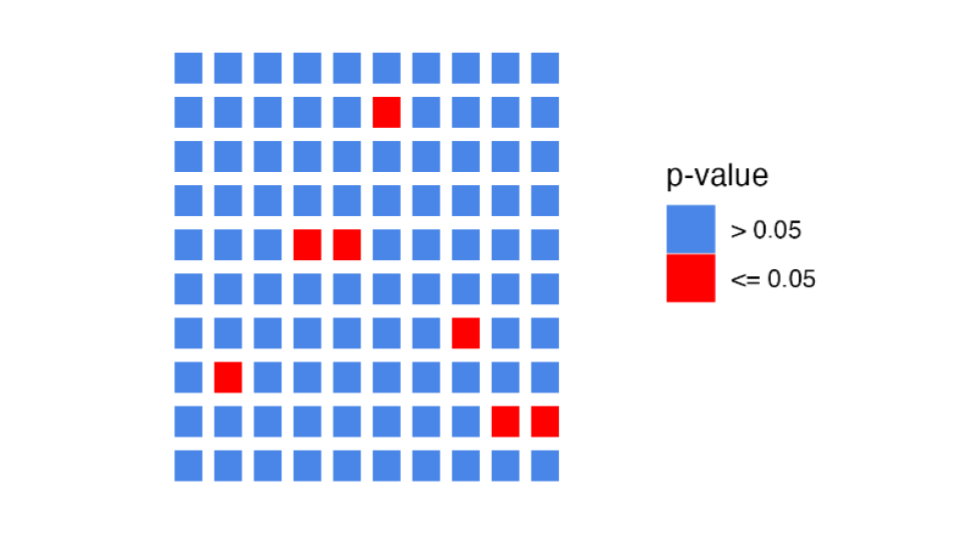

<style type="text/css">
body, td {
   font-size: 18px;
}
code.r{
  font-size: 12px;
}
pre {
  font-size: 12px
}
</style>

```{r, include = FALSE}
source("../bin/chunk-options.R")
knitr_fig_path("10-")
```

In this module, we will learn:

* What a p-value does (and does not!) represent
* How to modify and fit our DE model
* How to generate tables of DE statistics
* The importance multiple hypothesis corrections

<br>

```{r Modules, eval=TRUE, echo=FALSE, message=FALSE, warning=FALSE}
library(DESeq2)
library(tidyr)
library(dplyr)
# load("rdata/RunningData.RData")
```

# Differential Expression Workflow {.unlisted .unnumbered}

Now we will consider what we learned from our QC results before testing for differential expression between samples in our groups of interest.

{width=75%}

---

# Testing for DE

Before showing the code for generating differential expression results, let's walk through some toy data and discuss our intuition, its limitations, and what we can do to formalize our thought around determining if a gene is differentially expressed.

Let's start by looking at expression boxplots for a few "genes" where we've made up the data. In each plot, we are comparing the expression levels (on the y-axis) for samples (each point) representing a WT (red) and KO (teal) condition. The boxplot shows the 25% - 75% distribution, along with outliers, with a bar representing the median value, and a black-crossed-point representing the mean.

For the first example, we ask: Does the KO affect the expression of the gene?

{width=75%}

It seems pretty clear that there is a large difference between the means of the two groups, and within-group spread is quite low. So the answer to the question is likely "Yes".

Consider a second example:

{width=75%}

Here there isn't a large difference between the means of the two groups, and there is quite a bit of spread within-group. The answer here is likely "No".

Finally, consider a third example:

{width=75%}

The means are not so close to each other in this example, though there is still quite a bit of spread. This is example is perhaps less clear.

Looking at all three of the hypothetical genes together, we see them in relation to one another and how they span the range from No, to Maybe?, to Definitely.


Now, consider needing to make this decision for 20,000 genes. Even if all the genes had clear separation, that would take a lot of time. However, it's reasonable to expect to see a lot of genes with more ambiguous expression like Gene 2.

**We need a formal, reproducible, way to make this decision!**

Thankfully statistics provides the formality we want, but for any statistical test we need to clearly state what we are testing.  When testing for differential expression we assume that for any particular gene, there is no difference in expression between conditions. Statisticians would call this the **"null hypothesis"**.

For each gene, DESeq2 computes a "Wald statistic" which is a single number encapsulating the difference in the means and the spread of the groups. However, this number alone doesn't allow us to determine if a gene is differentially expressed. We need a **second** number to give us an idea of how extreme that statistic is among the distribution of possible statistics, which is the **"p-value"**. The **"p-value"** along with choosing a threshold will inform us if we can **reject the null hypothesis** and classify a gene as differentially expressed.

Imagine shuffling the group labels and recomputing the Wald statistic over and over again. You'd get a distribution of statistics that would look similar to a normal curve. The p-value essentially tells you how likely you are to have seen the statistic by chance. So when we set a p-value = 0.05 as a threshold, we're saying, "there is a 5% chance I'd see something this extreme when there was actually no effect". So the evidence is **strong**, but not **ironclad**.


# DESeq2 Model Fitting

Based on our PCA results, we'll copy our DESeq object and revise our original model design to add a covariate for "batch". Then, we'll fit our model using the `DESeq` function and take a look at the objects we generate. This command applies the model to our data, using the sample information supplied and model  `dds_batch` object so can take some time to run.

```{r FitModelBatch, message=FALSE}

#  access model slot from original `dds_filtered` DESeq2 object
design(dds_filtered)

# copy original object and then modify model
dds_batch_filtered = dds_filtered
design(dds_batch_filtered) <- ~ condition + batch

# after updating model, fit model with `DESeq` function
?DESeq
dds_batch_fitted = DESeq(dds_batch_filtered)
dds_batch_fitted
```

<!-- add as bonus: Accessing functions available for specific object types https://rpubs.com/mikelove/pkgmethods 
# see what functions are available for accessing/modifying our DESeqDataSet objects
showMethods(classes="DESeqDataSet", where=getNamespace("DESeq2"))--> 


While we won't be able to delve into model options in detail, more complex model designs including adding "interaction terms" between multiple group labels, are helpfully described in [this support thread](https://support.bioconductor.org/p/98628/) as well as in the [DESeq2 vignette](https://bioconductor.org/packages/release/bioc/vignettes/DESeq2/inst/doc/DESeq2.html#interactions).

<details>
    <summary>*Click for example of model design check*</summary>
    When including multiple terms in our model it's helpful to check the corresponding design matrix to ensure that our batches are not confounded, which would cause `DESeq2` to return a `model not full rank` error when attempting to fit the model. We can do that using the `model.matrix` function, providing our intended model and our sample information. 

```{r TestInteractions}
model.matrix(~ condition + batch, samplesheet_batch)
```
  When we look at the outputs, we can see that all of the returned columns have values (`1`) included. If our model was not full rank, then we would see a columns with no values (all `0`) returned.
</details>
<br>

<details>
    <summary>*Dispersion models and possible warning messages*</summary>

   Depending on the data set you are analyzing, you may see a warning that the default 'parametric' dispersion model so a local regression was substituted. When seeing this warning, we recommend looking at a dispersion plot with the `plotDispEsts(dds)` function, but as [this bioconductor thread](https://support.bioconductor.org/p/107937/) discusses, other visualizations of our data might be more helpful and/or easier to interpret why the data doesn't fit the default parametric model.

</details>
<br>
<br>

<details>
    <summary>*Click for code for a plot of dispersion estimates*</summary>
    We can visualize the **dispersion estimates** with the `plotDispEsts` function. This plot shows the the DESeq2 normalization results for our data, which centers on shrinking the variance across all genes to better fit the expected spread at a given expression level.
```{r CheckDispersions}
plotDispEsts(dds_batch_fitted)
```
    
   Above is the raw data plotted in black, the fitted (or expected) dispersion in red, and the normalized data with scaled variance in blue. Since we have fairly small sample sizes for each condition, we see shrinkage for many genes but a reasonable correlation between the expression level and dispersions.

   This [HBC tutorial](https://hbctraining.github.io/DGE_workshop/lessons/04_DGE_DESeq2_analysis.html) has a more detailed overview of estimating size factors, estimating gene dispersion, and the shrinkage procedure, as well as examples of concerning dispersion plots that may suggest reassessing quality of the experimental data.
</details>
<br>

Notice that there is now more information in the `DESeqDataSet` object than there was prior to our normalization. There is information about the model fit and about the library size normalization. DESeq2 will use this information when we perform the test for differential expression.

The `DESeq()` function is actually doing three things automatically for us. It calculates:

1. The size factors to normalize for library size with `estimateSizeFactors(dds_filtered)`,
2. Dispersion estimates to shrink the dispersions with `estimateDispersions(dds_filtered)`, and
3. The Wald test statistics with `nbinomWaldTest(dds_filtered)`.

The `resultsNames()` function returns the names of the estimated effects of the model. Note that  the results are stored based on the levels we set in the sample sheet and that the convention is to always have "case" first versus "control" second.

```{r FitModelStandardCheck1, eval=TRUE}
resultsNames(dds_batch_fitted)
```

The results include the single comparison representing the two levels of `condition`. If there were more levels in the `condition` column, there would be more results listed here because DESeq2 would implicitly compare all other levels to the reference level.


**Checkpoint**: *If you see the same results when you execute `resultsNames(dds_batch_fitted)`, please indicate with the green 'yes' button. Otherwise, please use the red 'x' button to get help*


# Generating DE Results

There is only the one comparison in the results, so we will refer to it in the `name` parameter of the `results()` function, and assign the result as an object.

```{r SetsResult}
results_deficient_vs_control = results(dds_batch_fitted, name = 'condition_deficient_vs_control')
head(results_deficient_vs_control)
```

If we look at the results table, we see that the row names are gene identifiers (in this case ENSEMBL IDs because that's what the GTF we used in the call to RSEM+STAR) and then we see the following columns:

1. `baseMean` is the average of the normalized count values, divided by size factors and taken over all samples, and can be interpreted as the relative expression level of that gene across all samples.
2. `log2FoldChange` is the log2 transformed ratio of the expression of the numerator group (first group) over the denominator group (second group after "vs"). Note that in our comparison, the `log2FoldChange` column compares the expression of `deficient` over the denominator group, `control`. If the value is positive, that means the expression of that gene is greater across the `deficient` samples than across the `control` samples. If the value is negative, that means the expression of that gene is greater across the `deficient` samples.
3. `lfcSE` is the standard error for the log2 fold change estimate.

> # Note: `results()` defaults {.unlisted .unnumbered}
> If no arguments are passed to `results()`, then the log2 fold changes and Wald test p-value will be for the **last variable** in the design formula, and if this is a factor, the comparison will be the **last level** over the **reference level**. If you specify `name`, as we did above, then the behavior is given by the name used from `resultsNames()`.

There are multiple ways to specify the test to be done using the `results()` function. It is especially helpful to know this when fitting more complex models and testing more complex contrasts. To demonstrate this, consider this description from the help for `results()`:

> `contrast`: a character vector with exactly three elements: the name of a factor in the design formula, the name of the numerator level for the fold change, and the name of the denominator level for the fold change

So an alternative way to test the same contrast as above (i.e.  `deficient` / `control`) is:

```{r SetsResultsAlt}
alt_results_deficient_vs_control = results(dds_batch_fitted, contrast = c('condition', 'deficient', 'control'))
head(alt_results_deficient_vs_control)
```

This way of calling `results()` is especially helpful when the levels of the column of interest contain more than two levels because you can specify exactly which levels to test with little confusion.

If we continue to look at the results table, after the `lfcSE` column we see:

4. `stat` is the calculated Wald statistic for that gene.
5. `pvalue` is the *nominal* significance that we described earlier.
6. `padj` is the *adjusted p-value* (also known as a "q-value") and is what we use for determining significantly differently expressed genes.


> # Question {.unlisted .unnumbered}
> Why should we use values from `padj` instead of the `pvalue`? Post in the Slack thread.

<br>

## Multiple hypothesis testing and FDR correction


Each p-value reported in the table is the result of a single test for a single gene. As stated earlier - with a significance cut-off of p-value < 0.05, we're expecting a 5% chance it is a false positive. However the more genes we test, the greater chance we have of seeing a significant results by chance. 

### The multiple hypothesis problem

For example, if we consider running the Wald test for 20 genes instead of just three, we might see something like this where `Gene N` has a p-value below our threshold of 0.05. If we see this pattern, do we expect that `Gene N` is actually differentially expressed (e.g. a true positive)?

<br>
{width=75%}
<br>

What if we tested 100 genes? How many genes would we expect to have p-values < 0.05, just by chance?

<br>
{width=75%}
<br>

What if we tested 10,000 genes? We would expect to see 500 genes with p-values < 0.05, just by chance!

<br>
{width=75%}
<br>

**So if we are testing 20,000 genes for differential expression, we would expect to see ~1,000 genes (5%) with statistical significance, just by chance.**
<br>

### The FDR solution

To address this [multiple hypothesis correction](https://multithreaded.stitchfix.com/blog/2015/10/15/multiple-hypothesis-testing/) can be performed. While there are a few approaches, the default method in DESeq2 is the False Discovery Rate (FDR) ([Benjamini and Hochberg (1995)](https://rss.onlinelibrary.wiley.com/doi/10.1111/j.2517-6161.1995.tb02031.x)).

The default FDR rate cutoff for our analyses is 0.05, meaning the proportion of false positives amongst our *differentially expressed genes* is controlled to 5%. So if we find 500 genes that are differentially expressed with this FDR cutoff, we expect only 25 of them to be false positives. DESeq2 vignette's includes a [further discussion of filtering and multiple testing correction](http://bioconductor.org/packages/devel/bioc/vignettes/DESeq2/inst/doc/DESeq2.html#independent-filtering-and-multiple-testing).

> # Note on `padj` values set to NA {.unlisted .unnumbered}
>
> As discussed in the [HBC tutorial](https://hbctraining.github.io/DGE_workshop/lessons/05_DGE_DESeq2_analysis2.html) as well as the [DESeq2 vignette](http://bioconductor.org/packages/devel/bioc/vignettes/DESeq2/inst/doc/DESeq2.html#i-want-to-benchmark-deseq2-comparing-to-other-de-tools.), DESeq2 reduces the number of genes that will be tested by removing genes with low number of counts and outlier samples.
>
> * If within a row, all samples have zero counts, the baseMean column will be zero, and the log2 fold change estimates, p-value and adjusted p-value will all be set to NA.
> * If a row contains a sample with an extreme count outlier then the p-value and adjusted p-value will be set to NA. These outlier counts are detected by [Cook’s distance](https://en.wikipedia.org/wiki/Cook%27s_distance).
> * If a row is filtered by automatic independent filtering, e.g. for having a low mean normalized count, then only the adjusted p-value will be set to NA.


## Save fitted model and data as .rds

It can be useful to save key R objects to file as we proceed through our analysis - before we do that, let's look at the documentation for the `save` function to see if it does what we want.

```{r SaveDocumentation}
?save
```

As we can see from the documentation the function `save` writes an "external representation" of R objects that can be read back from the file at a later date by using the function `load` or `attach` in most cases. We'll proceed with saving our `dds_batch_fitted` object, creating a subdirectory first.

```{r WriteFitModelObject}
dir.create("outputs/Robjs", recursive=TRUE)
save(dds_batch_fitted,
          file="outputs/Robjs/dds_batch_fitted.rds")
```


---

# Summary

In this section, we:

* Fitted our DESeq2 model
* Performed statistical tests for comparisons of interest
* Generated tables of differential expression results - i.e. fold changes and adjusted pvalues for each gene in dataset
* Discussed importance and application of multiple hypothesis correction
* Saved an Robject from our environment to file

Now that we've generated our differential comparisons and have an understanding of our results, including multiple hypothesis correction, we can determine how many genes are differentially expressed between our conditions and how to visualize our results.

---

# Sources

* HBC DGE training module, part 1: https://hbctraining.github.io/DGE_workshop/lessons/04_DGE_DESeq2_analysis.html
* HBC DGE training module, part 2: https://hbctraining.github.io/DGE_workshop/lessons/05_DGE_DESeq2_analysis2.html
* DESeq2 vignette: http://bioconductor.org/packages/devel/bioc/vignettes/DESeq2/inst/doc/DESeq2.html#differential-expression-analysis


```{r WriteOut.RData, eval=TRUE, echo=FALSE, message=FALSE, warning=FALSE}
# Hidden code block to write out data for knitting
# save.image(file = "rdata/RunningData.RData")
```

---

These materials have been adapted and extended from materials listed above. These are open access materials distributed under the terms of the [Creative Commons Attribution license (CC BY 4.0)](http://creativecommons.org/licenses/by/4.0/), which permits unrestricted use, distribution, and reproduction in any medium, provided the original author and source are credited.

<br/>
<br/>
<hr/>
| [Previous lesson](Module09_SampleQCViz.html) | [Top of this lesson](#top) | [Next lesson](Module11_DEVisualizations.html) |
| :--- | :----: | ---: |
